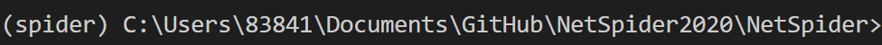
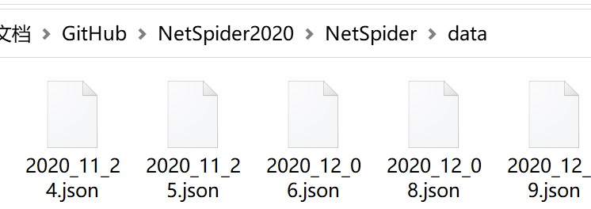
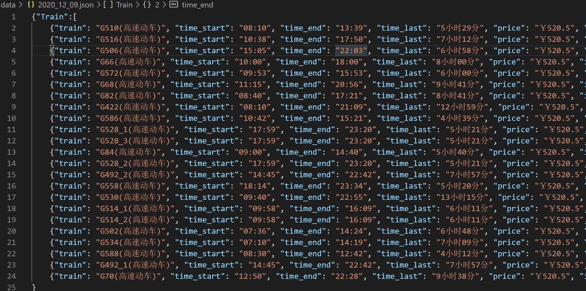

# NetSpider2020

### 1.爬虫使用说明

将当前目录调整为爬虫文件的根目录，在本项目中的样例目录地址如下：



在根目录下，通过cmd 输入，启动python文件 scrapy_starter.py 即可自动运行爬虫项目，并且从执行开始每天爬取一次数据，样例运行代码如下：

```powershell
C:/Users/83841/Anaconda3/envs/spider/python.exe c:/Users/83841/Documents/GitHub/NetSpider2020/NetSpider/scrapy_starter.py
```

### 2.数据介绍

在爬虫项目启动后，每次定时爬取都会在相对根目录的路径为./data的文件夹下，自动生成一个命名方式为 year_month_day.json 的json文件，代表了爬取该文件的年月日，包含了当天的爬取数据。样例如下：

 

爬取到的样例文件经过json格式化之后主要结构可以如下形式： 


在生成的json文件中，包含一个键值为 “Train” 的列表，里面包含了爬取的车次信息。

列表中的每一项信息及其含义如下样例:

```json
{
    //车次的名称
    "train":
    //该次动车发车时间
    "time_start":
    //该次动车运行到达终点站时间
    "time_end":
    //该次动车从出发站到终点站所需的时间
    "time_last":
    //该次动车二等座的票价，单位为人名币
    "price":
    //该次动车运行的描述性息，包含时间站点等
    "info":
    //包含该车次所有经停站的信息列表
    "stations":[{
    	//站点名称
    	"station_ame":
    	//动车到达该站点的时间
    	"arrive_time":
    	//动车离开该站点的时间
    	"leave_time":
    	//动车在该站点等待的时间
    	"wait_time":
    	//动车从起点站到该站点所经过的路程总数，单位为km
    	"miles":
	},
    {
		...
    },
     ... 
     ]
}
```

### 3.爬取数据结果截图

在2020年12月9日成功爬取到的数据样例如下：

